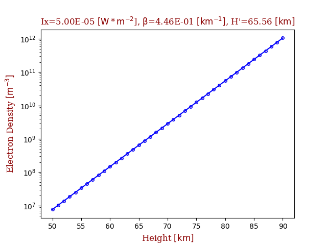

# flarED

## Flare Electron Density
For the input values of solar X-ray flux (Ix) we evaluate (interpolate) Wait's parameters beta and h' and calculate altitude values of electron density (for the low terrestrial ionosphere). 

The database of Wait's parameters beta and h' for different values of Ix (solar X-ray flux) i.e. different classes of solar flares (during the period of ascending phase and maximum of the solar cycle 24 i.e. during 2009–2014) is made. Solar flares are monitored and analyzed by VLF/LF technique and  parameters beta and h' obtained by method described in [1,2].

## EasyFit

To enable the better and more adequate use of data, we give ED results obtained using simple and accurate fitting formula based on a least-squares method, which is logarithmic and represented by a second-degree polynomial `log(ED(h, Ix)) = a1(h) + a2(h)*log(Ix) + a3(h)*(log(Ix))^2` with height dependent coefficients a1(h), a2(h), a3(h)

## Data
The parameters data were obtained computation using Fortran code on computer cluster [1,2].

## Prereqs
python3, numpy, scipy, matplotlib

## Usage

The database is already generated with the csv_to_sqlite.py script. It
is located under data/flarED.db

To run the main program:
```bash
python3 flarED_parser.py -ix IX
```
where IX is Solar X-Ray Flare, with accepted float values between [8e-07, 1e-04].

## Output

The output consists of a plot with altitude profile of electron density (sample plot is saved under img folder, you can choose not to save it or to save it somewhere else), csv files (for flared and easyfit methods) with columns of height and electron density and txt file with input Ix value and obtained parametres beta and h' (under results folder).



## Contact
Vladimir Sreckovic vlada(at)ipb.ac.rs
Veljko Vujcic veljko(at)aob.rs

## Related research articles:
[1] Šulić, D. M., Srećković, V. A., & Mihajlov, A. A. (2016). A study of
VLF signals variations associated with the changes of ionization level
in the D-region in consequence of solar conditions. Advances in Space
Research, 57(4), 1029-1043.

[2] Šulić, D. M., & Srećković, V. A. (2014). A comparative study of
measured amplitude and phase perturbations of VLF and LF radio signals
induced by solar flares. Serbian Astronomical Journal, (188), 45-54.
