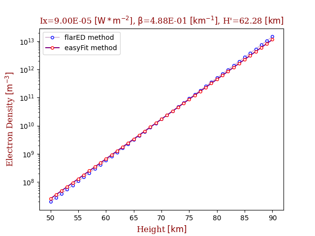
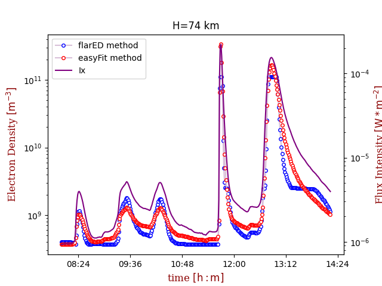

# flarED

## Flare Electron Density
For the input values of solar X-ray flux (Ix) we evaluate (interpolate) Wait's parameters beta and h' and calculate altitude values of electron density (ED) for the low terrestrial ionosphere.

The database of Wait's parameters beta and h' for different values of Ix (solar X-ray flux) i.e. different classes of solar flares (during the period of ascending phase and maximum of the solar cycle 24 i.e. during 2009–2014) is made. Solar flares are monitored and analyzed by VLF/LF technique and  parameters beta and h' obtained by method described in [1,2,3].

## EasyFit

To enable the better and more adequate use of data, we give ED results obtained using simple and accurate fitting formula based on a least-squares method, which is logarithmic and represented by a second-degree polynomial `log(ED(h, Ix)) = a1(h) + a2(h)*log(Ix) + a3(h)*(log(Ix))^2` with height dependent coefficients a1(h), a2(h), a3(h).

## Data
The parameters data were obtained computation using Fortran code on computer cluster [1,2].

## Prereqs
python3, numpy, scipy, matplotlib

## Usage

The database of above mentioned Wait's parameters is already generated with the csv_to_sqlite.py script. It
is located under data/flarED.db.

To run the altitude electron density profile calculator for a chosen Ix:
```bash
python3 flared_h_parser.py -ix IX
```
where IX is solar X-Ray flux [W*m^-2], with accepted float values
between [8e-07, 1e-04].

Input files for the time series are located under data/time_series.csv
and should be replaced with your own data, formatted the same way.

To run time series electron density calculator for a chosen altitude:
```bash
python3 flared_t_parser.py -he HE
```
where HE is altitude [km], with accepted int values between [50, 90].

Here we introduce time delay Δt as time between the maximum of the SF Flux and
maximum of the signal and electron density due to the ionosphere sluggishness.

It can be presented by linear dependence on logarithm of X-ray flux
`Δt= a + b*log(Ix)` where coefficients take values a = 0.45385 and b = -0.44863 and Ix<sub>max</sub>
is X-ray flux at peak time.

## Output

The output consists of a figure.png plot and a data_table.csv file,
located under results/flared_(h or t)-timestamp.

Fig. 1 shows vertical electron density profile (altitude profile) during the presence of solar X-ray flux intensity (Ix).



Fig. 2 shows solar X-ray flux intensity, and the corresponding electron density evaluated by FlarED and EasyFit at the selected height versus the time.



## Contact
Vladimir Sreckovic vlada(at)ipb.ac.rs
Veljko Vujcic veljko(at)aob.rs

## Related research articles:
[1] Srećković, V. A., Šulić, D. M., Ignjatović, L., & Vujčić, V. (2021). Low Ionosphere under Influence of Strong Solar Radiation: Diagnostics and Modeling. Applied Sciences, 11(16), 7194.

[2] Šulić, D. M., Srećković, V. A., & Mihajlov, A. A. (2016). A study of
VLF signals variations associated with the changes of ionization level
in the D-region in consequence of solar conditions. Advances in Space
Research, 57(4), 1029-1043.

[3] Šulić, D. M., & Srećković, V. A. (2014). A comparative study of
measured amplitude and phase perturbations of VLF and LF radio signals
induced by solar flares. Serbian Astronomical Journal, (188), 45-54.

